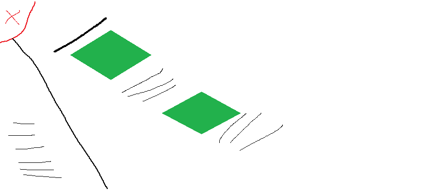
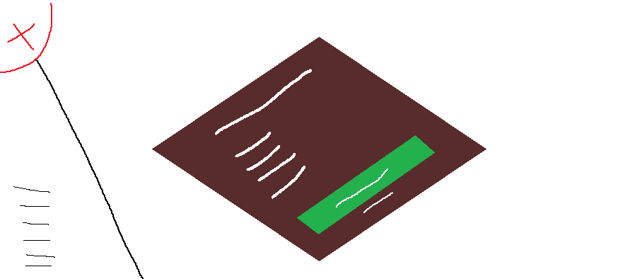

# Trabalho prático #

### Grupo ###

- Diogo Oliveira | Nºa35271
- Diogo Pereira | Nºa036886
- João Almeida | Nºa041243

---

## Indice ##
- [Trabalho prático](#trabalho-prático)
    - [Grupo](#grupo)
  - [Indice](#indice)
  - [Definição do tema](#definição-do-tema)
  - [Interface](#interface)
  - [Produto](#produto)
  - [Validação do código](#validação-do-código)
  - [Conclusão e Discusão](#conclusão-e-discusão)
  - [Referências](#referências)

---

## Definição do tema ##

Este projeto consiste na criação de um website informativo que tem como objetivo dar informação sobre o diferente tipo de plantas que se pode encontrar nos diferentes tipos de floresta, a informação apresentada no site será resultada da pesquisa do grupo em relação ao tema escolhido. O website será constituído por sies páginas **HTML** estáticas, onde o design será feito em **CSS**. O site vai ser composto por uma página inicial que vai apresentar os tipos de floresta com imagens, legenda e referencia das imagens colocadas. Ao carregar no link da floresta que pretende investigar, o utilizador será direcionado para outra página que irá mostrar a informação relacionada com o clima, as plantas e o tipo de animais encontradas na floresta selecionada anteriormente pelo utilizador. A página que contem a informação sobre o tipo de floresta também será acompanhado com imagens dessas mesmas florestas, plantas, animais e com *links* de outras pesquisas. Para alem disso, o *website* também irá ter uma página com um formulário para que o utilizador possa entrar em contacto com o grupo, para o caso dele se encontrar com duvidas em relação ao conteúdo encontrado no *websit*e.  No site vamos utilizar toda a matéria que foi lecionado/praticada ao longo do semestre para um melhor aproveitamento do conteúdo que aprendemos.

---

## Interface ##

---

## Produto ##

O produto final, é composto por seis páginas estáticas de **HTML** (página inicial, quatro páginas para cada tipo de floresta referida e uma página para o utilizador entrar em contacto com o grupo). Ao entrar no site, será apresentada a página inicial, que tem o propósito de introduzir o tema falado neste trabalho, para isso, esta página contém conteudo sobre as florestas, uma lista dos diferentes tipos de floresta e uma tabela com uma pequena compação entre os diferentes tipos.
Ao clicar o botão, que se encontra no canto superior esquerdo do ecrã, será mostrado o nome das diferentes páginas (Home, Floresta Boreal, Floresta Tropical, Floresta Temperada, Floresta Subtropical e contacto). O utilizador, ao clicar nos nomes das páginas será direcionado para a página escolhida, onde estará presente informação sobre os diferentes tipos de floresta, no caso do utilizador selecionar a página do contacto, ele será direcionado para uma página onde poderá deixar o seu nome, email e uma mensagem. Nas diferentes páginas, também está presente ao longo da navegação um botão que, ao clicar, irá dirigir o utilizador para o início da página onde se encontra.

---

## Validação do código ##

Em relação á validação do código, este foi passado no validador do  **W3C** e foi corrigido de acordo com os erros que o validador apresentava. Erros apresentados pelo **W3C** era composto por erros relacionados com "*Stray end tag's*" e "*Unclosed elements*".

---

## Conclusão e Discusão  ##

---

## Referências ##